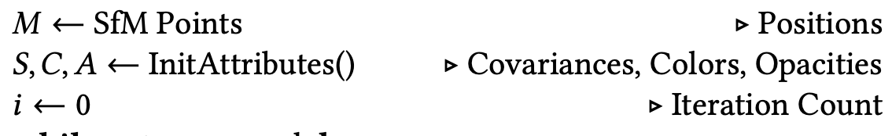

# [REVIEW] 3DGS : 3D Gaussian Splatting for real time radiance field rendering (작성중)
> SIGGRAPH 2023 </br>
> Bernhard Kerbl, Georgios Kopanas, Thomas Leimkühler, George Drettakis</br>
> Inria | Université Côte d'Azur | MPI Informatik

오늘 리뷰하는 논문은 NeRF와 같이 Novel View Synthesis 분야에 엄청난 인기를 끌었던 3D Gaussian Splatting에 대한 논문입니다. NeRF 논문이 발표되고 해당 방법을 개선하는 내용의 논문과 응용한 논문이 엄청나게 쏟아졌었는데, 현재 3DGS를 활용한 논문도 계속해서 발표되고 있어 해당 내용을 정리하고자 진행하게 되었습니다.

3DGS는 NeRF의 task와 동일한, image set과 camera pose값이 주어지면 다양한 시점에 대해서 Rendering을 수행하여 해당 scene을 3D로 표현합니다. 해당 논문에서 제안한 방법의 결과는 고해상도(1080p) Rendering quality 부문 SOTA를 기록한 Mip-NeRF 360 보다 뛰어난 결과를 보였으며, Training time 부문 SOTA를 기록한 InstantNGP 보다 빠르게 학습이 가능합니다.

지금부터 어떻게 이런 결과를 이룰 수 있었는 지에 대해서 이해한 내용을 설명해보도록 하겠습니다.

## Overview
<p align=center>
    
</p>

해당 논문의 전체 흐름은 위의 그림과 같은 순서로 구성되어 있습니다.
4개의 핵심 Block으로 구성되어 있어 어떻게 구성되어 있는지 쉽게 파악할 수 있었습니다.

1. Initialization : 3D Gaussian의 초기값을 설정하는 구간입니다. COLMAP과 같은 SfM(Structure from Motion) 알고리즘을 이용하여 연속된 이미지를 통해 카메라 파라미터와 Point Cloud를 추출하여 초기 3D Gaussian의 값으로 할당해줍니다.
2. Projection : 3D Gaussian을 2D Image plane으로 투영시켜 2D Gaussian으로 변환하는 구간입니다. Image plane으로 투영시켜 Ground Truth 이미지와 비교하여 학습과정에서 모델의 파라미터를 업데이트하기 위한 구간입니다.
3. Differentiable Tile Rasterizer : 해당 블럭의 이름에서 알 수 있듯이, 미분 가능한 Tile들을 Rasterization하여 이미지를 생성하는 구간입니다. 해당 논문의 빠른 Rendering이 가능하도록 한 핵심 아이디어 부분이라고 생각합니다.
4. Adaptive Density Control : 역전파 과정에서 Gradient를 통해 Gaussian의 형태를 업데이트 하는 구간입니다. 해당 논문에서는 Under Reconstruction과 Over Reconstruction의 경우에 대해 Optimization 과정을 거쳐 수행한다고 합니다.

Gradient Flow는 학습 과정에서 역전파로 계산된 Loss에 의해 업데이트하는 과정입니다. </br>
지금부터는 각 단계에 대해 자세하게 알아보도록 하겠습니다.

## 1. Initialization
Initialization block에서는 3D Gaussian을 구성하고 학습에 사용되는 M, S, C, A 파라미터의 초기값을 설정합니다.

<p align=center>
    
</p>

`M`은 COLMAP과 같은 SfM 알고리즘을 통해 획득한 3D Point Cloud를 초기값으로 설정합니다. Gaussian은 **평균과 분산**으로 구성되게 되는데, 해당 논문에서는 3D Gaussian을 사용하기 때문에 분산이 아닌 공분산으로 구성됩니다. Point Cloud는 3D Gaussian의 초기 평균값으로 사용되며, Point Cloud의 수와 동일한 Gaussian들이 생성됩니다.

`S`는 3D Gaussian의 공분산을 나타냅니다. 3차원에 해당하기 때문에 3x3 크기의 행렬입니다. 

$$ \sum = RSS^{T}R^{T} $$

논문에서는 공분산의 수식을 $\sum$ 기호로 나타냈습니다. Scaling factor로 구성된 vector $S$와 Rotation에 관련된 quarternion을 변환한 $R$로 구성하였고, 독립적인 Opimization을 위해 각 factor들을 따로 저장했다고 합니다.

`S`는 아래와 같은 코드로 값을 할당받게됩니다.

```python
dist2 = torch.clamp_min(distCUDA2(torch.from_numpy(np.asarray(pcd.points)).float().cuda()), 0.0000001)
scales = torch.log(torch.sqrt(dist2))[...,None].repeat(1, 3)
```

`distCUDA2`는 cuda 코드로 작성된 함수로, 평균값을 return해주는 함수입니다. 아마 Point Cloud의 수가 상당히 많아 소요되는 시간을 줄이기 위해 따로 cuda 함수를 작성하여 사용한 것으로 보입니다. 이후, root와 log를 취한 값을 복사하여 3x3 행렬로 만들었습니다.

```python
rots = torch.zeros((fused_point_cloud.shape[0], 4), device="cuda")
rots[:, 0] = 1
```

Matrix `R`은 point마다 크기가 4이고 0으로 초기화된 벡터를 만들어 첫번째 값에만 1로 할당하여 초기값을 세팅하였습니다.

이렇게 공분산 수식을 구성한 이유는 3D Gaussian을 Rendering 할 수 있도록 2D로 변환하는 과정에서 image space에 맞추기 위해서 입니다.(image space가 좌측 상단 (0,0)에서 우측 하단 방향으로 좌표값이 증가하게 되는데, 이를 위해 공분산 행렬이 positive semi definite를 만족하도록(?) 설계했다고 봅니다.)

3D Gaussian을 2D로 Projection하는 수식은 아래와 같습니다.

$$ {\sum}' = JW \sum W^{T}J^{T}$$

$J$는 projective transfomation의 선형 변환을 위한 Jacobian 행렬로 카메라 좌표계를 이미지 좌표계로 변환시켜주는 역할을 합니다.

$W$는 카메라 파라미터를 나타내는 행렬로, 월드 좌표계를 카메라 좌표계로 변환시켜주는 역할을 합니다.

$\sum$은 위에서 구한 월드 좌표계에서의 Covariance를 나타냅니다.

`C`는 3D Gaussian의 색상값을 나타내는데, 해당 논문에서는 Spherical Harmonics(SH)라고 하는 함수로 설계했습니다. SH는 Computer Graphics분야에서 3D 물체가 여러 광원에 영향을 받아 변하는 색상을 실시간으로 계산하기 위해 사용한다고 합니다. 구면 좌표계에서 $\theta$와 $\phi$를 입력 받아 해당 위치의 구면값을 반환하는 함수입니다. 구면좌표계를 라플라스 방정식을 계산하면 아래와 같은 SH 함수($Y_{l}^{m}(\theta, \phi)$)와 확률밀도함수($P_{l}^{\vert m \vert} \cos\theta$)를 얻을 수 있습니다. 수식을 유도하는 과정은 [link](https://elementary-physics.tistory.com/126)에 자세하게 나와있습니다.

$$ Y_{l}^{m}(\theta, \phi) = \sqrt{{(2l+1)(l- \vert m \vert)!}\over{4 \pi (l+ \vert m \vert)!}}P_{l}^{\vert m \vert} \cos\theta e^{im\phi} $$

$$ P_{l}^{\vert m \vert} \cos\theta = (-1)^{m} \frac {(l+ \vert m \vert)!}{(l- \vert m \vert)!}P_{l}^{-\vert m \vert}\cos\theta $$

위의 식에서 $l$은 방위 양자수를 나타냅니다. 오비탈의 모양을 결정하는 양자수로 0 ~ n-1 의 값을 갖습니다. $m$은 자기 양자수를 나타내는데, 음수, 0, 양수 등의 값을 갖고 오비탈의 공간 방향을 나타냅니다. 

<p align=center>
    
</p>

위의 수식의 $\theta$와 $\phi$를 x, y축에 대한 평면으로 표현하여 색을 구성하는 map을 만들어 사용합니다. [Wikipedia](https://en.wikipedia.org/wiki/Table_of_spherical_harmonics)에 따르면 SH 함수의 크기는 Saturation(선명도)을 나타내고 위상은 Hue(밝기)를 나타낸다고 합니다.

[논문](https://3dvar.com/Green2003Spherical.pdf)에 따르면, 최종적으로 `C`는 입력된 $\theta, \phi$에 따라 계산된 각 SH 함수의 결과를 weighted sum하여 결정하게 됩니다. 이때, $l$의 최대값은 고정되어 있기 때문에, 정해진 Y 함수 내에서 가중치 값을 조절하여 색상을 결정합니다.

`A`는 3D Gaussian의 Opacity를 나타내는 값입니다. 초기값은 inverse sigmoid를 사용하여 음수값으로 할당하였는데 특별한 이유는 없는 것 같습니다.

## 2. Projection + 3. Rasterize
다음 과정에서는 Projection block과 Differentiable Tile Rasterizer block을 거쳐 이미지를 생성하고 실제 이미지와 비교하여 Loss를 계산하며 학습을 진행하게 됩니다.

<p align=center>
    
</p>

먼저, `SampleTrainingView` 함수를 통해 카메라 파라미터 `V`와 Ground Truth 이미지 $\hat{I}$ 를 읽어옵니다. 읽어온 카메라 파라미터 `V`는 위에서 초기화한 `M`, `S`, `C`, `A`와 함께 `Rasterize` 함수의 입력으로 사용되어 이미지 `I`를 생성합니다.

<p align=center>
    
</p>

실제 함수에서는 이미지 크기를 나타내는 `w`와 `h` 변수들도 입력으로 받게 되어있는데, 초기값이 이미 설정되어 있어 따로 입력값을 전달하지는 않습니다.

