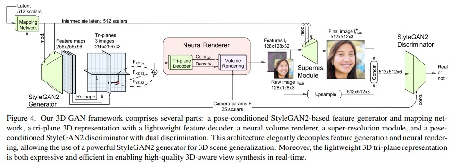
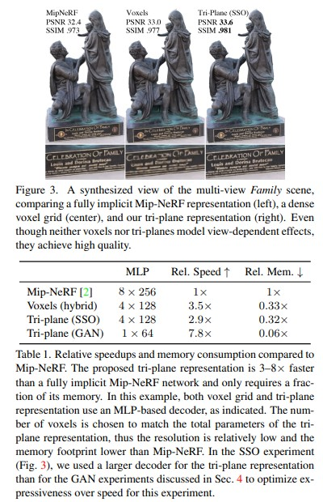
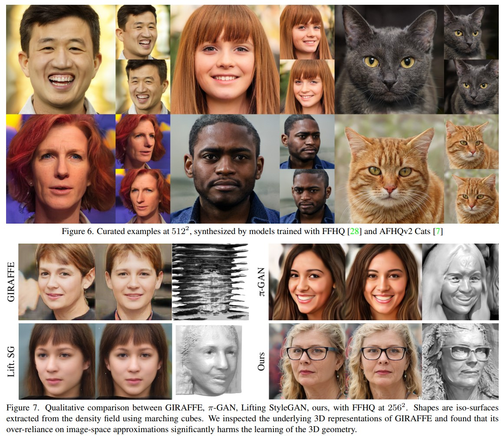
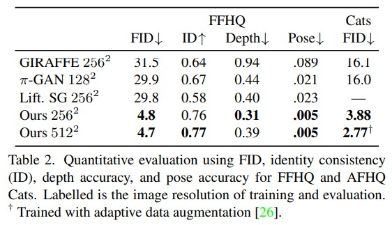

# [REVIEW] EG3D : Efficient Geometry-aware 3D Generative Adversarial Networks
> CVPR 2022 </br>
> Eric R. Chan, Connor Z. Lin, Matthew A. Chan, Koki Nagano, Boxiao Pan, Shalini De Mello, Orazio Gallo, Leonidas J. Guibas, Jonathan Tremblay, Sameh Khamis, Tero Karras, Gordon Wetzstein </br>
> Stanford Univ | NVIDIA

오늘 리뷰하려는 논문은 3D GAN 모델 중 하나인 `EG3D` 입니다. `3D GAN`은 `NeRF`와 `GAN`을 합쳐 **3D-aware**한 이미지 생성을 목표로 하는 생성 모델의 한 종류입니다. `EG3D`에서는 빠르고 선명한 이미지 생성을 위해 `1. Hybrid Representation` 방법을 제안하였고, 불필요한 View-inconsistent를 정규화하기 위한 `2. Dual Discriminator`를 제안하였습니다. 자세한 내용은 아래에서 설명하겠습니다.

현재까지 발표된 `GAN` 모델은 **1. 고해상도 이미지**나 **2. Photorealistic한 이미지** 등을 생성이 가능하여 놀라운 결과를 보여주고 있습니다. 하지만, 2차원에서만 동작 가능하다는 단점이 있어 생성하는 데이터가 이미지에 한정됩니다. </br>
`3D GAN`은 단어에서 유추할 수 있듯이, 3차원 정보 출력이 가능한 `GAN`(이하 `2D GAN`) 모델입니다. **3D Position**이나 **Multi view** 데이터 없이 다양한 각도의 이미지 생성이 가능하다는 것이 큰 장점입니다. 한편, `2D GAN`의 이미지 생성 결과에 비해서는 **1. 이미지의 퀄리티가 낮고**, **2. 3D shape 마저 정교하지 못하다**는 평이 있었습니다. </br>
`3D GAN`은 모델의 Generator가 갖는 3차원 구조에 대한 Inductive bias와 View-consistent한 이미지를 생성하기 위한 Neural Rendering의 조합으로 결과를 생성합니다. 기존에 사용하는 3차원 좌표와 같이 **Implicit**한 방법이나 Voxel과 같은 **Explicit**한 방법은 Single scene에 대해서 괜찮은 결과를 보여주었지만, **1. 메모리 사용이 비효율적**이고 **2. 너무 느리다**는 단점이 있습니다.

`EG3D`에서는 기존의 **3D GAN과 Data Representation 방법의 문제점**을 개선하기 위한 방법들을 제시하였는데, 어떤 내용이 있는지 이해한 내용을 바탕으로 설명해보겠습니다.

<p align=center>
    
</p>

위 사진은 `EG3D`의 전체 구조입니다. 학습 흐름을 간략하게 설명해보자면, 로부터 `Latent vector`를 전달받아 `Stylegan2 Generator`를 통해 **Feature Map**을 생성하고 `Tri-plane`으로 변형합니다. 그 후, `Neural Renderer` 모듈을 통해 Feature Image($I_F$)를 생성합니다. $I_F$는 Super resolution 모듈을 통과하여 $I^+_{RGB}$를 생성하고, $I_F$의 첫 3채널 $I_{RGB}$와 Concat하여 `Dual Discriminator`를 통해 결과를 판별합니다. (막상 쓰고보니 간략하지 않은 것 같네요..ㅎ)</br>

이제 위의 과정을 하나씩 짚어가며 설명해보곘습니다.

## 1. Mapping Network & Tri-plane Representation
`Mapping Network`에 Latent vector와 카메라 파라미터를 바탕으로 **새로운 Feature vector**를 출력합니다. 카메라 파라미터를 사용한 이유는 **카메라 포즈와 다른 속성에 대한 Decoupling을 유도**하기 위함입니다. 이렇게 하면, `Pose Conditioning`을 통해 데이터셋에 포함된 `Pose-dependent bias`를 표현할 수 있다고 합니다. </br>
이후, 이미지 생성을 위한 `StyleGAN2의 Generator`를 이용해서 **96채널의 Feature**를 추출하고 32채널씩 Reshaep하여 제안한 방법인 `Tri-plane`을 생성하였습니다. `Tri-plane`이 `EG3D`에서 제안한 Hybrid한 방법의 **Key point**입니다. 코드를 보면 더 쉽게 이해하실 수 있습니다.

```python
def generate_planes():
    """
    Defines planes by the three vectors that form the "axes" of the
    plane. Should work with arbitrary number of planes and planes of
    arbitrary orientation.
    """
    return torch.tensor([[[1, 0, 0],
                            [0, 1, 0],
                            [0, 0, 1]],
                            [[1, 0, 0],
                            [0, 0, 1],
                            [0, 1, 0]],
                            [[0, 0, 1],
                            [1, 0, 0],
                            [0, 1, 0]]], dtype=torch.float32)

def project_onto_planes(planes, coordinates):
    """
    Does a projection of a 3D point onto a batch of 2D planes,
    returning 2D plane coordinates.

    Takes plane axes of shape n_planes, 3, 3
    # Takes coordinates of shape N, M, 3
    # returns projections of shape N*n_planes, M, 2
    """
    N, M, C = coordinates.shape
    n_planes, _, _ = planes.shape
    coordinates = coordinates.unsqueeze(1).expand(-1, n_planes, -1, -1).reshape(N*n_planes, M, 3)
    inv_planes = torch.linalg.inv(planes).unsqueeze(0).expand(N, -1, -1, -1).reshape(N*n_planes, 3, 3)
    projections = torch.bmm(coordinates, inv_planes)
    return projections[..., :2]
```

위의 `generate_planes`함수가 Tri-plane을 생성하는 코드인데 생각보다 간단합니다. 각 면이 이루는 정보를 벡터로 표시하여 나타내었고, `project_onto_planes`함수로 각 면에 투영시킵니다. 여기서, `coordinates`변수는 카메라 파라미터로 생성한 Ray를 나타냅니다. 다음에 `StyleGAN2 Generator`로 생성한 **Feature**를 투영된 Ray의 좌표에 따라 Sampling 후 Summation을 통해 최종 **Feature**를 생성합니다. </br>
`Tri-plane`은 Implicit한 방법과 같이 3차원 좌표 정보를 활용하였고, 해당 정보를 각 축이 이루는 면에 투영함으로써 Explicit한 방법을 동시에 사용하였습니다. 그 결과, 각 방법의 장점을 갖는 Hybrid한 방법을 구현하였습니다.(자세한 내용은 [EG3D 논문]("https://nvlabs.github.io/eg3d/media/eg3d.pdf")의 3번 항목에서 확인하실 수 있습니다.) </br>

논문에서 제시한 Single Scene Overfitting(SSO) 실험에서도 `Tri-plane` Representation 방법이 기존보다 우수하다는 것을 증명하였습니다.

<p align=center>
    
</p>

$x, y, z$에 해당하는 3차원 좌표를 각 축이 이루는 평면 $F_{xy}, F_{xz}, F_{yz}$에 투영시킴으로써, 채널을 줄이는 효과를 볼 수 있다고 합니다. 위의 실험 결과에서 볼 수 있는 것 처럼, Implict한 방법을 기준으로 약 **7.8배가 빠르고, 메모리 효율도 우수**한 것을 볼 수 있습니다.

## 2. Super resolution
`Tri-plane Representation`이 빠르고 효율적이다고 증명이 되었지만, NeRF와 3D GAN에서 가장 오래걸리는 부분은 Neural Rendering 부분입니다. 해당 논문에서는 작은 사이즈의 feature map을 Upsampling하는 방법으로 문제점을 해결하였습니다.

## 3. Dual Discriminator
저자는 Rednering 결과와 최종 출력 이미지 사이의 View-inconsistent tendency를 정규화하여 **consistency를 유지**하기 위해 `Dual Discriminator`를 도입했다고 합니다. 여기서, Dual의 의미는 Discriminator를 2개 쓴 것이 아니라, $I^+_{RGB}$와 $I_{RGB}$ 2개의 입력을 사용한다는 뜻으로 해석됩니다. 이렇게 하면, 두 이미지 사이의 Consistency를 유지할 수 있다고 합니다.

Dual Disciriminator는 최종 결과가 실제 이미지의 분포와 일치시키고, Neural Rendering의 결과가 축소된 실제 이미지의 분포와 일치시킵니다. 이 과정에서, view-inconsistency 때문에 발생하는 arifacts를 제거할 수 있다고 합니다. 해당 논문에서 제시한 결과를 보면 $I^+_{RGB}$와 $I_{RGB}$가 상당히 일치하는 것을 볼 수 있습니다.

<p align=center>
    
</p>


추가적으로, Discriminator를 통과하는 과정에서 카메라 파라미터를 제공함으로써, pose-aware 하도록 학습을 진행합니다. 이렇게 하면, Generator가 이미지를 생성하는 과정에서 좀 더 정확하게 3D prior를 학습한다고 합니다.

아래의 코드를 통해 어떻게 구성되었는지 살펴보겠습니다.
```python
class DualDiscriminator(torch.nn.Module):
    def __init__(self,
        c_dim,                          # Conditioning label (C) dimensionality.
        img_resolution,                 # Input resolution.
        img_channels,                   # Number of input color channels.
        architecture        = 'resnet', # Architecture: 'orig', 'skip', 'resnet'.
        channel_base        = 32768,    # Overall multiplier for the number of channels.
        channel_max         = 512,      # Maximum number of channels in any layer.
        num_fp16_res        = 4,        # Use FP16 for the N highest resolutions.
        conv_clamp          = 256,      # Clamp the output of convolution layers to +-X, None = disable clamping.
        cmap_dim            = None,     # Dimensionality of mapped conditioning label, None = default.
        disc_c_noise        = 0,        # Corrupt camera parameters with X std dev of noise before disc. pose conditioning.
        block_kwargs        = {},       # Arguments for DiscriminatorBlock.
        mapping_kwargs      = {},       # Arguments for MappingNetwork.
        epilogue_kwargs     = {},       # Arguments for DiscriminatorEpilogue.
    ):
        super().__init__()
        img_channels *= 2

        self.c_dim = c_dim
        self.img_resolution = img_resolution
        self.img_resolution_log2 = int(np.log2(img_resolution))
        self.img_channels = img_channels
        self.block_resolutions = [2 ** i for i in range(self.img_resolution_log2, 2, -1)]
        channels_dict = {res: min(channel_base // res, channel_max) for res in self.block_resolutions + [4]}
        fp16_resolution = max(2 ** (self.img_resolution_log2 + 1 - num_fp16_res), 8)

        if cmap_dim is None:
            cmap_dim = channels_dict[4]
        if c_dim == 0:
            cmap_dim = 0

        common_kwargs = dict(img_channels=img_channels, architecture=architecture, conv_clamp=conv_clamp)
        cur_layer_idx = 0
        for res in self.block_resolutions:
            in_channels = channels_dict[res] if res < img_resolution else 0
            tmp_channels = channels_dict[res]
            out_channels = channels_dict[res // 2]
            use_fp16 = (res >= fp16_resolution)
            block = DiscriminatorBlock(in_channels, tmp_channels, out_channels, resolution=res,
                first_layer_idx=cur_layer_idx, use_fp16=use_fp16, **block_kwargs, **common_kwargs)
            setattr(self, f'b{res}', block)
            cur_layer_idx += block.num_layers
        if c_dim > 0:
            self.mapping = MappingNetwork(z_dim=0, c_dim=c_dim, w_dim=cmap_dim, num_ws=None, w_avg_beta=None, **mapping_kwargs)
        self.b4 = DiscriminatorEpilogue(channels_dict[4], cmap_dim=cmap_dim, resolution=4, **epilogue_kwargs, **common_kwargs)
        self.register_buffer('resample_filter', upfirdn2d.setup_filter([1,3,3,1]))
        self.disc_c_noise = disc_c_noise

    def forward(self, img, c, update_emas=False, **block_kwargs):
        image_raw = filtered_resizing(img['image_raw'], size=img['image'].shape[-1], f=self.resample_filter)
        img = torch.cat([img['image'], image_raw], 1)

        _ = update_emas # unused
        x = None
        for res in self.block_resolutions:
            block = getattr(self, f'b{res}')
            x, img = block(x, img, **block_kwargs)

        cmap = None
        if self.c_dim > 0:
            if self.disc_c_noise > 0: c += torch.randn_like(c) * c.std(0) * self.disc_c_noise
            cmap = self.mapping(None, c)
        x = self.b4(x, img, cmap)
        return x

    def extra_repr(self):
        return f'c_dim={self.c_dim:d}, img_resolution={self.img_resolution:d}, img_channels={self.img_channels:d}'
```

전체 구조는 Stylegan2의 Discriminator의 구조와 비슷하다고 볼 수 있습니다. 초기에 `self.block_resolutions`을 계산하여 for문을 통해 Discriminator를 구성하였습니다. 해당 논문에서 말하는 Pose Conditioning은 아래의 코드에서 이루어지는 것을 볼 수 있습니다.
```python
if c_dim > 0:
    self.mapping = MappingNetwork(z_dim=0, c_dim=c_dim, w_dim=cmap_dim, num_ws=None, w_avg_beta=None, **mapping_kwargs)
self.b4 = DiscriminatorEpilogue(channels_dict[4], cmap_dim=cmap_dim, resolution=4, **epilogue_kwargs, **common_kwargs)
```

학습 과정에서 카메라 파라미터를 전달받아 Mapping Network로 Embedding 시켜 사용하는 것을 볼 수 있었습니다.

## 학습 과정 및 결과
학습 에서는 Non Saturating GAN Loss와 R1 Regularization을 사용하여 모델을 학습하였습니다. 학습 속도를 향상시키기 위해서 two-stage 전략을 사용했다고 합니다. 처음에 작은 해상도(${64}^2$)의 입력으로 모델을 학습시키고, 본래 크기(${128}^2$)로 fine tuning을 진행하였습니다. 

<p align=center>
    
</p>

View에 따른 Consistency를 잘 학습하여 고해상도의 이미지를 생성한 것을 볼 수 있었습니다. 개인적으로 놀라운 점은 Figure 7에서 볼 수 있는 것 처럼 3D shape이 매우 정교하다는 점이었습니다. 

<p align=center>
    
</p>

성능지표에서도 FFHQ와 Cats 데이터셋에서 SOTA의 결과를 낸다고 합니다. 우선, FID 지표에서 볼 수 있듯이 생성 이미지의 품질이 굉장히 고화질인 것을 알 수 있었습니다. 전체 모델을 Pose-aware하게 학습함으로써, Pose의 정확도가 매우 높은 것을 볼 수 있습니다. 그리고, 3차원 정보를 2차원 평면에 투영시킨 Tri-plane을 사용하여 3D shape의 정확도 역시 기존보다 우수한 것을 볼 수 있습니다.

다만, 저자도 논문에 표현하였듯이 치아와 같은 부분이 정교하지 못하다는 단점이 있고, Pose에 대한 Knowledge가 필요하다는 단점이 있었습니다.

## Comment
오늘은 EG3D의 논문에 대해서 리뷰를 해보았습니다. 논문을 읽으면서 3D GAN의 전체 흐름과 원리에 대해 복습하는 기회가 되었습니다. 이 논문이 발표된 이후로 Tri-plane을 사용한 다양한 논문들이 발표되고 있어 한 번쯤 자세하게 다루고 싶었는데, 드디어 하게 되었습니다...ㅎ

대학원을 다니면서 다양한 논문을 읽어보고 혼자 이해하고 넘어갔었는데, 이렇게 리뷰를 작성하는 것은 익숙하지가 않아 설명이나 글이 이상한 것 같습니다. 앞으로 더욱 다양한 논문 리뷰를 통해 글을 다듬어 보겠습니다!