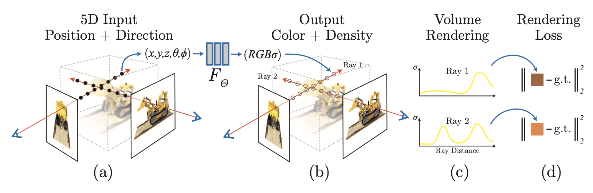
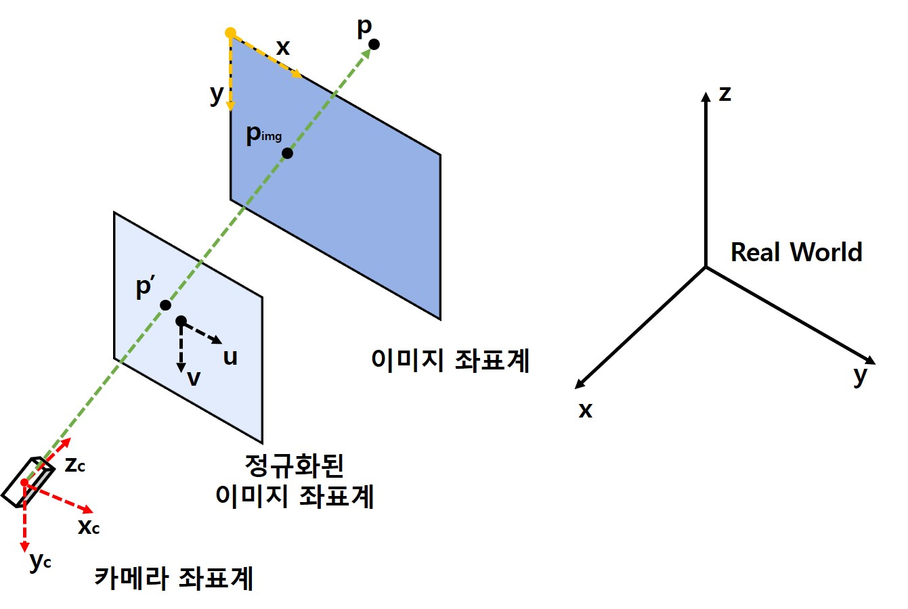
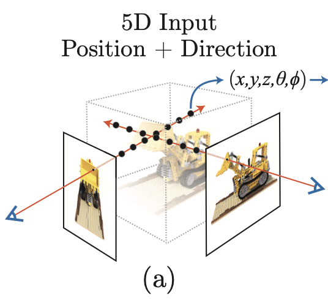
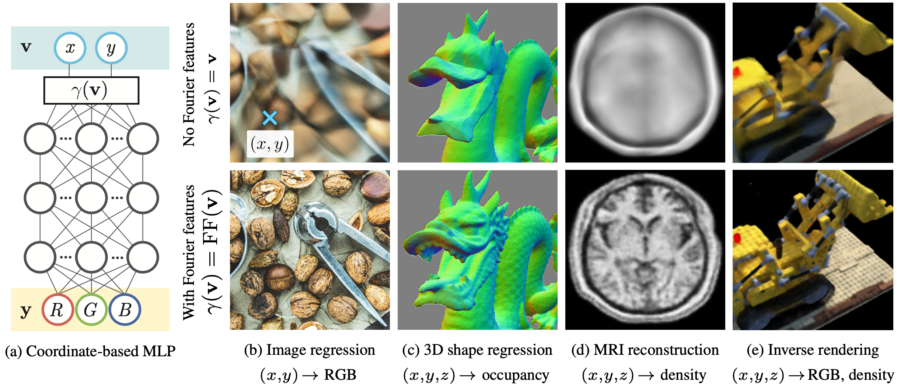

# Neural Radiance Fields(NeRF)
[REVIEW] Neural Radiance Fields for View Synthesis 

[Project page](https://www.matthewtancik.com/nerf)

## INTRO
기술이 발전하면서 3D 게임을 넘어 AR/VR 등의 많은 컨텐츠 등이 생기고 있으며, 이를 위해 실제 사물에 대한 3D 오브젝트를 생성하여 가상의 공간에서 활용할 수 있도록 하는 방법이 많이 쓰이고 있음

출처 : https://hello.vrchat.com

기존 3D 오브젝트 생성을 위한 별도의 장비나 Photogrammtrey 방법보다 더욱 효과적으로 수행하는 방법인 NeRF가 2020 ECCV에서 발표됨

NeRF는 실제로 3D 오브젝트를 생성하는 것이 아니라 새로운 View point에서 바라보는 이미지를 생성하여 연속적인 2D 이미지를 통해 3D 같은 효과를 제공함

이러한 방법은 기존 Point Cloud, Voxel, Mesh와 같이 Computing resource가 많이 필요하지 않음

  
출처: paper "Neural Radiance Fields for View Synthesis", fig. 1

## Overview : Neural Radiance Fields
  
출처: paper "Neural Radiance Fields for View Synthesis", fig. 2

(a) NeRF는 3차원 좌표 Position($x, y, z$)와 카메라 파라미터($\theta, \phi$)가 결합된 5차원 데이터를 입력으로 사용함

(b) MLP($F_\theta$)를 통해 입력에 대한 결과로 RGB와 $\sigma$(Density)를 출력함 

(c) 출력된 RGB와 $\sigma$는 Volume Rendering 기법을 통해 해당 각도에서 발사한 Ray가 지나는 점들을 압축하여 2차원 이미지로 변환됨

(d) 실제 이미지와 비교하여 생성된 이미지와의 차이를 최소화하며 학습을 진행함

## (1) 5D Input Position + Direction
이미지를 NeRF 모델을 통해 학습하기 위해서는 카메라 파라미터에 대해 알아야 함

Official NeRF github을 보면 입력 데이터는 이미지와 Pose값을 입력으로 함  
Pose값은 4x4행렬로 구성된 카메라 외부 파라미터(Extrinsic parameter)이며, 이미지를 월드상의 3D 좌표로 변환할 때 사용되는 행렬임

$$
\begin{pmatrix} 
        u \\ 
        v \\
        1 
    \end{pmatrix} = 
\begin{pmatrix} 
        f_x & 0   & c_x \\
        0   & f_y & c_y \\
        0   & 0   & 1
    \end{pmatrix}
\begin{pmatrix} 
        r_{1,1} & r_{1,2} & r_{1,3} & t_1 \\
        r_{2,1} & r_{2,2} & r_{2,3} & t_2 \\
        r_{3,1} & r_{3,2} & r_{3,3} & t_3
    \end{pmatrix}
\begin{pmatrix} 
        X \\
        Y \\
        Z \\
        1 
    \end{pmatrix}
$$

위의 식에서 **$r$** 과 **$t$** 로 구성된 행렬이 카메라 외부 파라미터 행렬이며, 각각 카메라의 회전 성분과 이동 성분을 나타냄  
외부 파라미터 행렬 왼쪽에 **$f_x, f_y$** 와 **$c_x, c_y$** 로 구성된 행렬은 카메라 내부 파라미터 행렬이며, 각각 초점 거리와 광학 중심점을 나타냄

이러한 카메라 파라미터를 변환하여 NeRF 모델의 핵심인 **Ray**를 생성하며, 이는 물체를 찍은 방향에서 물체를 향해 일직선으로 쏜 선을 의미함  
Overview의 그림에서 (a)가 그 예시임  

    

**Ray**는 이미지의 크기만큼 생성되며 각 **Ray**의 방향을 나타내는 **viewing direction(d : $\theta, \phi$)** 와 발사한 **Ray**가 지나는 점들의 좌표값 **potition(x: $x, y, z$)** 를 MLP의 입력으로 사용함
$$F_\theta : (x, d) = (c, \sigma)$$

이 과정에서 **Fourier feature encoding**을 통해 low frequency 영역과 high frequency 영역 둘 다 표현할 수 있도록 하였음  
이러한 인코딩의 결과는 [project page](https://bmild.github.io/fourfeat/), [paper](https://arxiv.org/abs/2006.10739)에서 증명하였음  
 
출처 : paper "Fourier Features Let Networks Learn
High Frequency Functions in Low Dimensional Domains"

## (2) output + volume rendering
제안한 방법에서는 **position**과 **viewing direction**을 입력으로 하여금 MLP로 이루어진 딥러닝 모델로부터 **RGB**와 **Density**값을 추출함 
**RGB**는 이미지 전체에 해당하는 색상값이 아니라 **viewing direction**이 가르키는 해당 픽셀의 색상을 나타냄 
**Density**는 밀도로써 사용되었으며, 해당 값이 클수록 해당 픽셀이 선명하다는 것을 뜻함

논문에서 픽셀의 색상을 구하는 식은 아래와 같이 사용하였음 
가장 가까운 점 $t_n$과 가장 먼 점 $t_f$ 사이에 있는 점들의 **RGB**, **Density**, 그리고 논문에서 도입한 투과도를 곱하여 픽셀의 색상을 정함 
$T(t)$는 투과도를 나타내는 식으로 음수로 변환하여 임의의 점 t 앞에 있는 모든 점들의 Density값을 합하여 나타냄 
즉, 값이 클수록 앞에 있는 점들에 가려 해당 점이 가려진다는 것을 뜻 함 
$r(t)$는 Ray를 뜻하는 수식임

$$
C(r) = \int_{t_n}^{t_f} T(t) \sigma(r(t))c(r(t), d)dt,\\
T(t)=exp(-\int_{t_n}^{t}\sigma(r(s))ds),\\
r(t) = o + td
$$

이러한 과정을 거쳐 volume rendering을 수헹하여 전체 이미지에 해당하는 픽셀의 색상을 결정함
